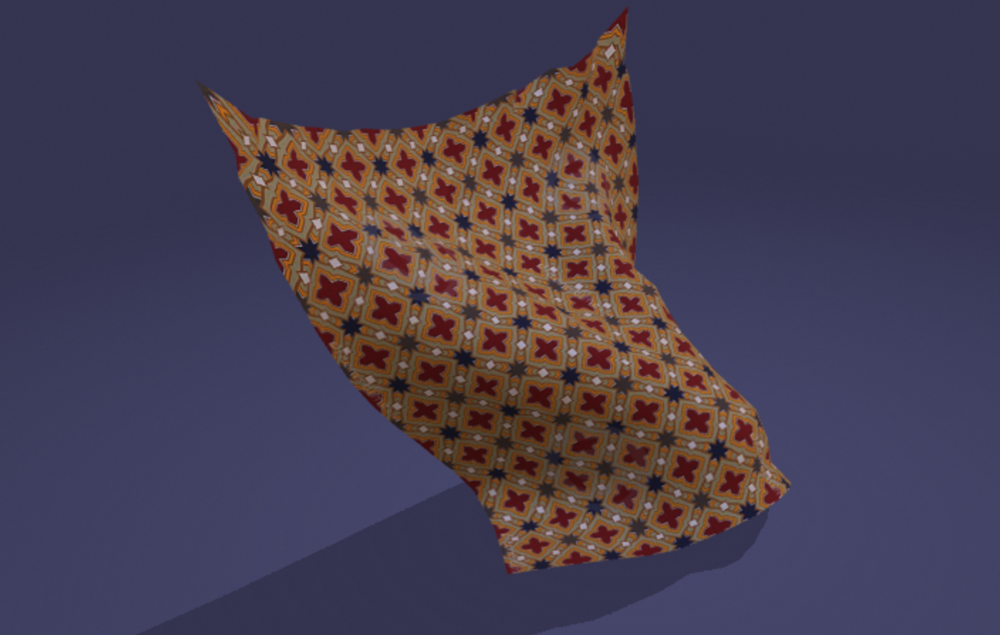
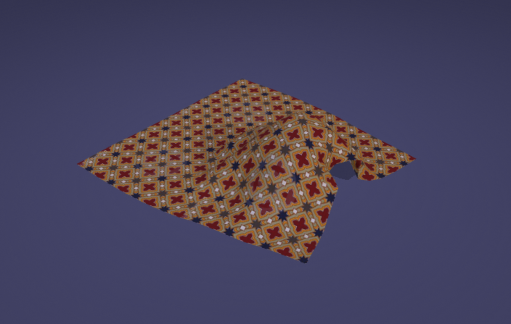

# Coth Simulation

[](https://github.com/BarthPaleologue/babylonjs-template/actions/workflows/webpack.yml)

A simple simulation of cloth based on [OpenCloth](https://github.com/BarthPaleologue/opencloth) and [BabylonJS](https://www.babylonjs.com/).




This project has been created using **webpack-cli**, you can now run

```
npm run build
```

or

```
yarn build
```

to bundle your application
